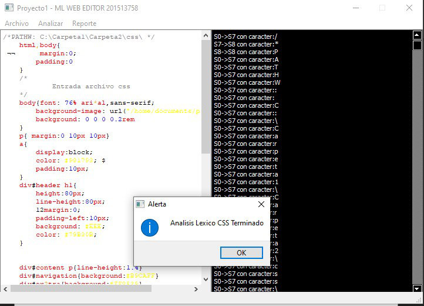
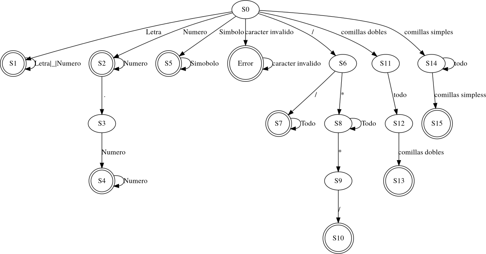

# PROYECTO ML WEB 
PROYECTO 1 ORGANIZACIÓN DE LENGUAJES Y COMPILADORES 1

HORACIO CIRAIZ ORELLANA

## INDICE
1. [Descripcion](#Descripcion)
2. [Analizadores](#Analizadores)
3. [Interfaz](#Interfaz)
4. [Reportes](#Reportes)
5. [Automatas](#Automatas)

## **Descripcion**
***
La aplicación ML Web es una aplicación desarrollada en lenguaje Python que sirve como un analizador de distintos lenguajes que tiene como fin la detección y eliminación de errores lexicográficos para que el usuario pueda hacer uso de esta y sirva como herramienta para los programas que un usuario pueda desarrollar. Dicha eliminación de errores se hará por medio de la implementación de un Analizador Léxico de estados el cual se encargará de recolectar todos los tokens correctos y crear un archivo limpio de errores el cual se le especificará la ubicación de guardado.
ML Web cuenta con una interfaz minimalista e intuitiva para facilitar el uso a los usuarios, todos y cada uno de los analizadores, así como la interfaz están separados por medio de distintos módulos y clases, por lo que es fácil analizar el código fuente del programa y aislar cualquier sección que sea necesaria para el técnico.
Para el área de Reporte se implementó varias herramientas, Graphviz 2.38 para la realización del reporte JS y la implementación de Paginas HTML para los distintos reportes de errores.

## **Analizadores**
***

>### Analizador Lexico:
El analizador Léxico cuenta con 4 módulos de Análisis Léxico con el nombre de LexicoJS.py, LexicoCSS.py, LexicoHTML.py y LexicoExpresion.py en los cuales se manejó dicho análisis por medio de estados los cuales se encargan de reconocer carácter a carácter , dichos estados fueron implementados basándose en ER (Expresiones Regulares) mediante un análisis de los requerimientos del lenguajes y la creación de AFD (Autómatas Finitos Deterministas) para dicha implementación (Se encuentran en la carpeta `Analizador` de este proyecto).

### **Expresiones Regulares:**
Las expresiones regulares son patrones utilizados para encontrar determinadas combinaciones de caracteres dentro de una cadena de texto. Proporcionan de una manera flexible la capacidad de buscar y reconocer cadenas de texto

| Expresion | Patron |
|:--------------:|:-------------:|
| Identificador | [Letra]+([Letra]|[Numero]|_) *| 
| Numero |  [Numero]+(.[Numero]+)| [Numero]+ *| 
| Simbolo |  ( (%\|=\|;\|:\| \| > \| <\| ( \| ) \| } \| { \|+\| -\| .\| ,\| !\| &\| \|)|
| Cadena | “(Todo)” \| ’(Todo)’| 
| Comentario |  /\*(Todo menos “*”)*/ \| // (Todo menos\n) \n| 

>### Analizador Sintactico:
El analizador sintáctico cuenta con 1 modulo llamado SintacticoExpresion.py el cual se baso en una gramática y se implemento por medio de un método de Pila para hacer las verificaciones correspondientes para la validación de la cadena en un orden correcto
(Se encuentran en la carpeta `Analizador` de este proyecto).

## Interfaz
*** 
En esta pantalla se muestra los principales Menús de Archivo, Reporte y Analizar así como también la consola de entrada donde el texto cambiará de color de acuerdo al lenguaje que se reconozca y también se cuenta con una consola de salida.

>### **Menú Archivo:**
En este Menú se encuentra la Opción de Nuevo, Abrir, Guardar y Guardar Como

>### **Menú Analizar:**
En este Menú se encuentran las opciones de Analizar los distintos lenguajes, ya sea JS, CSS, HTML y RMT.

### **Analizar JS:**
Analizar JS permite analizar el archivo abierto previamente y generar una imagen que muestra el recorrido de las expresiones regulares en formato de un Autómata

### **Analizar CSS:**
Analizar CSS permite analizar el archivo abierto previamente y generar una imagen que muestra el recorrido dentro del analizador, lexema por lexema en forma de Bitácora

### **Analizar HTML**
Analizar HTML permite analizar el archivo abierto previamente y mostrar reportes posteriormente.

## Reportes
***
Los distintos reportes con los que cuenta la herramienta se crean ya se de forma automática en algunos casos o por medio de algún evento en la interfaz gráfica.

>### **Menu reportes**
En este Menú se encuentran las opciones de Reportes de Errores de los distintos lenguajes que puede procesar el programa JS, CSS, HTML.

>### **Reporte HTML**
Los reportes en formato HTML son reportes que se crean por medio de la acción en el menú de Reportes,estos sirven para crear tablas con reporte de errores.

1. Reporte Errores JavaScript
2. Reporte Errores CSS
3. Reporte Errores HTML
4. Reporte Resultado RMT

>### Reporte Imagen Autómata
Este reporte crea de forma automática luego del análisis del JS una imagen con el Grafo del recorrido de ciertas cadenas a través del analizador

>### Reporte Bitácora
Este reporte crea de forma automática luego del análisis del CSS una bitácora de transiciones que sufrió el analizador CSS.

## Automatas
***

### AFD JavaScript:

### AFD HTML:

### AFD CSS:

